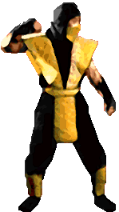
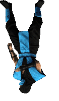

  

<h1 align="center" style="font-family: 'Roboto', cursive;">
   
   Projeto - Mortal Kombat
   
</h1>

<h2 style="font-weight: 900; margin: 1.2rem 0.45rem">
   Projeto feito no evento da Mapa Dev Week  
   
   (Project made at Mapa Dev Week event)
   
</h2>

Objetivo era criar uma pagina que trocasse de personagens utilizando JavaScript .
Nas aulas os personagens eram da Marvel e tive a liberdade de fazer a troca do layout por personagens da minha preferencia,
no caso da franquia de jogos Mortal Kombat.

**(The goal was to create a page that changed characters using JavaScript. In the classes, the characters were from Marvel and
I had the freedom to change the layout to characters of my preference, in the case of the Mortal Kombat game franchise)**

 

<h2 style="font-weight: 900; margin: 1.2rem 0.45rem">
   Linguagens utilizadas  
   
   (Languages used)
   
</h1>

 - CSS
 - HTML
 - JAVASCRIPT

 

<h2 style="font-weight: 900; margin: 1.2rem 0.45rem">
   Você pode conferir o resultado acessando o link:   
   
   (You can check the result by accessing the link)
   
</h2>

- [https://kaahsilva.github.io/projeto-mortal-kombat/](https://kaahsilva.github.io/projeto-mortal-kombat/)

 

<h2 style="font-weight: 900; margin: 1.2rem 0.45rem">
   Resultado final   
   
   (Final result)
   
</h2>

 

<address>
   

      ~ Made in 💜 by <strong>@kaahSilva</strong> 
       
       
      
   

</address>
